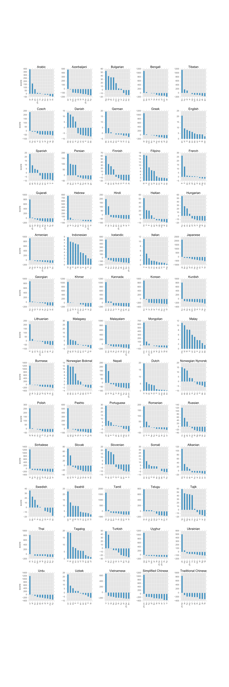
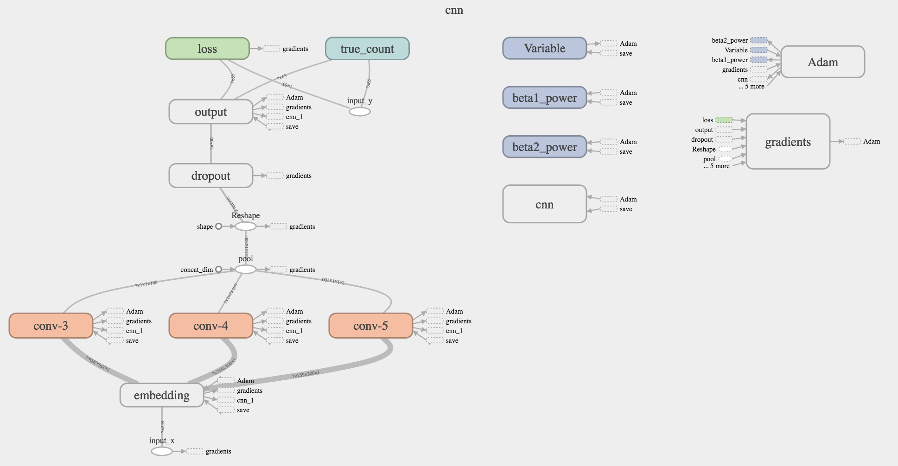

# Convolutional Neural Network for Language Detection

**Note:** 

---

## Demo


## Requirements

- [Tensorflow](https://www.tensorflow.org/)
- [Numpy](http://www.numpy.org/)

To download TED corpus

- [Beautifulsoup](https://www.crummy.com/software/BeautifulSoup/bs4/doc/)
- [Pandas](http://pandas.pydata.org/)

Web API

- [Flask]()

## Preprocess

Download TED Corpus
```sh
python ./ted.py
```

Prepare train/test Data  
```sh
python ./util.py
```

## Training

```sh
python ./train.py
```

## Prediction

```python
import predict

res = predict.predict(u'日本語のテスト')
print re['prediction']
```

## Evaluation

```sh
python ./eval.py --train_dir=./model/ted500
```

## Run TensorBoard

```sh
tensorboard --logdir=./model/ted500/summaries
```

## Use as Web API

### Run API Server

Deploy to Heroku 
[](https://heroku.com/deploy)
```sh
heroku create --buildpack https://github.com/kennethreitz/conda-buildpack.git cnn-ld-tf
git push heroku master
```

or
```sh
python ./main.py
```

### Request

For example, send GET request as

```
https://cnn-ld-tf.herokuapp.com/predict?text="日本語のテスト"
```

### Response

```json
{
  "prediction": "ja", 
  "scores": {
    "en": -1344.27,
    "fr": -1003.39,  
    "de": -788.429, 
    "ja": 1795.52,
        .
        .
        .
  }
}
```

## References

CNN for text classification:

* https://github.com/yuhaozhang/sentence-convnet
* https://github.com/dennybritz/cnn-text-classification-tf
* http://www.wildml.com/2015/12/implementing-a-cnn-for-text-classification-in-tensorflow/
* http://tkengo.github.io/blog/2016/03/14/text-classification-by-cnn/

TED Corpus:

* https://github.com/ajinkyakulkarni14/How-I-Extracted-TED-talks-for-parallel-Corpus-

Language Detection:

* http://drops.dagstuhl.de/opus/volltexte/2014/4574/pdf/22.pdf

Web API on heroku:

* https://github.com/sfujiwara/pn2bs


## Pre-trained model

* Corpus domain: speech transcriptions
* Number of train examples: 29250 (450 per language)
* Number of dev examples: 3250 (50 per language)
* Parameters:
    + `data_dir = './data/ted500'`
    + `train_dir = './model/ted500'`
    + `batch_size = 100`
    + `emb_size = 300`
    + `num_kernel = 100`
    + `min_window = 3`
    + `max_window = 5`
    + `vocab_size = 4090`
    + `num_classes = 65`
    + `sent_len = 259`
    + `l2_reg = 0.0`
    + `optimizer = 'adam'`
    + `init_lr = 0.01`
    + `lr_decay = 0.95`
    + `tolerance_step = 500`
    + `dropout = 0.5`
    + `log_step = 10`
    + `summary_step = 200`
    + `save_epoch = 5`
     
* Supported languages (65):
   `["ar", "az", "bg", "bn", "bo", "cs", "da", "de", "el", "en", "es",
     "fa", "fi", "fil", "fr", "gu", "he", "hi", "ht", "hu", "hy", "id",
     "is", "it", "ja", "ka", "km", "kn", "ko", "ku", "lt", "mg", "ml",
     "mn", "ms", "my", "nb", "ne", "nl", "nn", "pl", "ps", "pt", "ro",
     "ru", "si", "sk", "sl", "so", "sq", "sv", "sw", "ta", "te", "tg",
     "th", "tl", "tr", "ug", "uk", "ur", "uz", "vi", "zh-cn", "zh-tw"]`

* Results:

    | best 10 | avg. score | precision | recall | f1 |
    |--------:|-----------:|----------:|-------:|---:|
    |Tamil  |1665.068186   |1.00    |1.00  |1.00|
    |Sinhalese  |1242.680933   |1.00    |1.00  |1.00|
    |Burmese  |1223.794847   |1.00    |1.00  |1.00|
    |Tibetan  |1158.023875   |1.00    |1.00  |1.00|
    |Uyghur  |1106.284894   |1.00    |1.00  |1.00|
    |Bengali  |1101.598435   |1.00    |1.00  |1.00|
    |Greek  |1088.558152   |1.00    |1.00  |1.00|
    |Khmer  |1055.261601   |1.00    |1.00  |1.00|
    |Armenian  | 941.679072   |1.00    |1.00  |1.00|
    |Korean  | 919.747124   |1.00    |1.00  |1.00|  
    
    
    | worst 10 | avg. score | precision | recall | f1 |
    |---------:|-----------:|----------:|-------:|---:|
    |Indonesian |8.933    |0.667    |0.040    |0.075|
    |Tagalog    |19.005   |0.400    |0.080    |0.133|
    |Norwegian Bokmal     |12.547   |0.381    |0.640    |0.478|
    |Danish     |13.471   |0.458    |0.540    |0.495|
    |Norwegian Nynorsk    |15.516   |0.733    |0.440    |0.550|
    |Malay      |11.190   |0.458    |0.980    |0.624|
    |Filipino   |16.709   |0.506    |0.880    |0.642|
    |Italian    |11.146   |0.548    |0.920    |0.687|
    |German     |19.375   |0.719    |0.820    |0.766|
    |Slovak     |72.622   |0.830    |0.780    |0.804|  
    
    
    |      | avg. score | precision | recall | f1 |
    |-----:|-----------:|----------:|-------:|---:|
    |top  5| 1279.171|    1.000|    1.000|    1.000|
    |top 15| 1045.956|    1.000|    1.000|    1.000|
    |top 25|  954.115|    0.998|    0.983|    0.990|
    |top 35|  797.532|    0.981|    0.967|    0.973|
    |top 45|  647.085|    0.968|    0.949|    0.957|
    |top 55|  540.608|    0.950|    0.925|    0.936|
    |   all|  460.522|    0.891|    0.877|    0.873|  
    
    

* Train log:
    
     
* Character embeddings:
    

* Score distribution:
    

* False-positives distribution:
    

* Model structure:
    